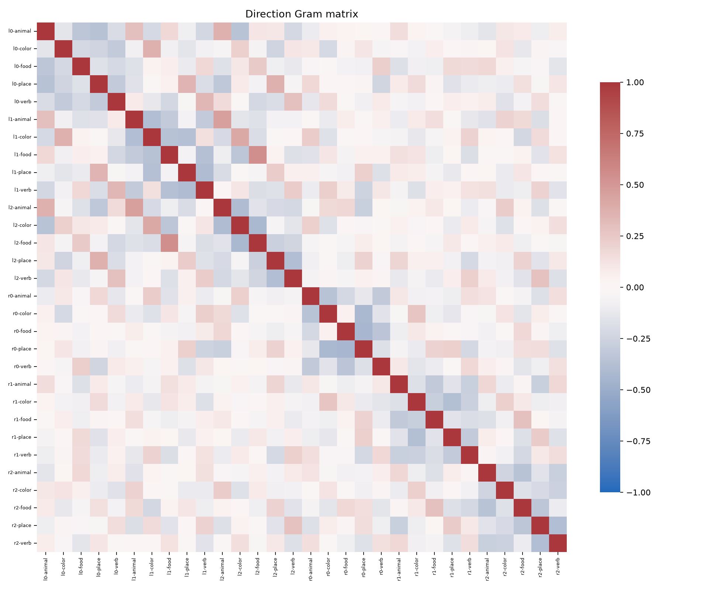
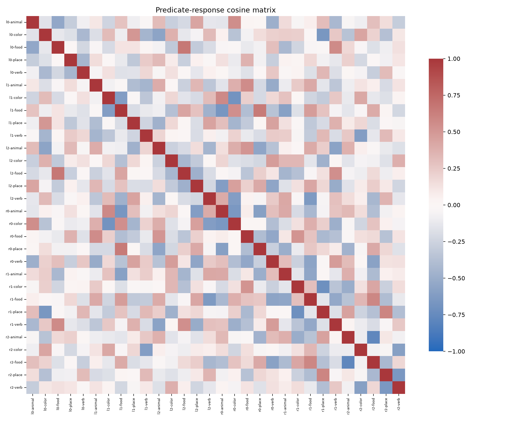
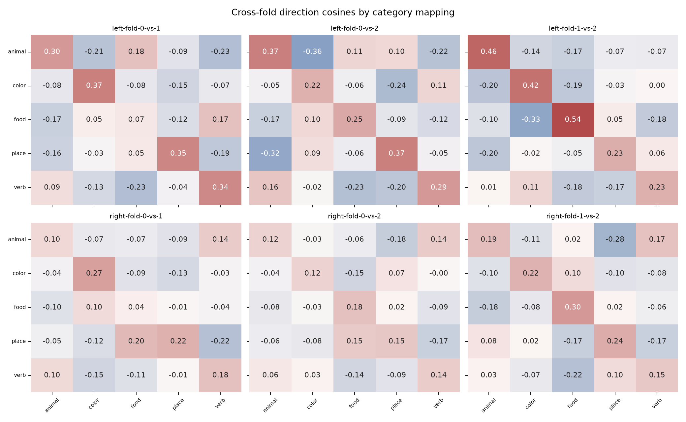

# Jane Street Steering Vectors

This repository is for investigating the Jane Street puzzle model published on Hugging Face:

- Puzzle Space: https://huggingface.co/spaces/jane-street/puzzle
- Model artifact repo: https://huggingface.co/jane-street/2025-03-10/tree/main

The puzzle presents a PyTorch model artifact and a simple text input interface. Python 3.11 uses `model_3_11.pt`; older Python versions use `model.pt`. The Space sends a raw string directly into the model and returns a numeric output. The hint on the puzzle page suggests starting by looking at the last two layers.

The goal of this project is to reverse engineer what the model computes from text input. In practical terms, that means safely inspecting the serialized PyTorch archive, understanding how the text is represented, identifying the important model layers, and designing experiments that reveal the scoring rule or hidden transformation behind the returned number.

## Current Findings

The model is a 2,721-stage `Linear -> ReLU` circuit with 288,998,553 parameters. It converts the
first 55 characters into Unicode code points, null-pads shorter text, and processes the resulting
float32 vector without a tokenizer or learned input embedding. The final circuit checks 16 exact
integer predicates and returns a positive result only when all 16 hold. See
`docs/architecture_findings.md` for the recovered equations and evidence.

Milestone 3 ran 257 controlled inputs twice each. The 514 observations were deterministic and all
returned zero, including order, case, punctuation, repetition, length, and balanced semantic
factorial contrasts. This is consistent with a sparse exact-match circuit and means the final
scalar alone cannot expose the underlying lexical or positional features. See
`docs/behavioral_probing.md`.

Milestone 4 captures the final circuit, fits leakage-free whole-lexeme semantic directions, and
performs hash-bound causal interventions. The semantic estimator is a null result: left accuracy
is 0.180 and right accuracy is 0.207 versus 0.200 chance. Canonical replacement verifies the gate,
and all 1,800 semantic intervention observations agree with the recovered downstream algebra.
See `docs/representation_and_causal_analysis.md`.

Milestone 5 adds deterministic local-geometry and findings synthesis. The 30 candidate directions
have numerical rank 24. The exact `16 x 192` predicate Jacobian agrees with `torch.func`, and the
analysis reproduces all 530 observed predicate-ReLU crossing observations with zero mismatches.
Readout and output Hessians are zero at a clean fixed-region point, as expected for the recovered
piecewise-affine circuit. See `docs/final_report.md` and `docs/research_log.md`.

The model file remains untrusted serialized input. Direct pickle loading is disabled; live
architecture analysis is available only through the hash-gated namespace and Landlock launcher.

The current inspection script can:

- Read the `.pt` file as a ZIP archive.
- Compute its SHA-256 digest using bounded memory.
- Record artifact provenance and compare the digest with a trusted value.
- Locate `puzzle/data.pkl` and raw tensor storage files under `puzzle/data/`.
- Parse pickle opcodes with `pickletools` without executing the pickle payload.
- Summarize persistent storage references and map them back to archive byte sizes.
- Report useful metadata such as storage counts, storage types, storage devices, and sample tensor-like references.
- Export the full module tree, all parameter metadata, callable bytecode, the final two leaf
  modules, and the final two parameterized modules inside a restricted worker.
- Enforce exact artifact/runtime compatibility and reject Python 3.12 for Python 3.11 bytecode.
- Deny network access and non-allow-listed filesystem access during live loading.

## Repository Layout

```text
.
├── planning.md
├── MILESTONES.md
├── ARTIFACTS.md
├── pyproject.toml
├── requirements/
│   ├── analysis-cpu.txt
│   └── geometry-analysis.txt
├── docs/
│   ├── architecture_findings.md
│   ├── behavioral_probing.md
│   ├── final_report.md
│   ├── glossary.md
│   ├── observations.md
│   ├── representation_and_causal_analysis.md
│   ├── research_log.md
│   └── semantic_directions_and_local_geometry.md
├── examples/
│   └── summarize_linear_shapes.py
├── experiments/
│   ├── activations/
│   │   └── m4-capture-smoke-v1.json
│   └── probes/
│       ├── m3-semantic-factorial-v1.json
│       └── m3-smoke-v1.json
├── scripts/
│   ├── architecture_worker.py
│   ├── activation_schema.py
│   ├── activation_worker.py
│   ├── activation_sandbox_entry.sh
│   ├── analyze_activation_report.py
│   ├── analyze_local_geometry.py
│   ├── generate_intervention_specs.py
│   ├── generate_probe_manifests.py
│   ├── inspect_model.py
│   ├── intervention_schema.py
│   ├── intervention_worker.py
│   ├── landlock_exec.py
│   ├── local_geometry_schema.py
│   ├── probe_sandbox_entry.sh
│   ├── probe_schema.py
│   ├── probe_worker.py
│   ├── run_architecture_sandbox.py
│   ├── run_activation_sandbox.py
│   ├── run_intervention_sandbox.py
│   ├── run_probe_sandbox.py
│   ├── sandbox_entry.sh
│   └── synthesize_findings.py
├── src/
│   └── jsmi/
│       └── __init__.py
├── outputs/
│   ├── activations/
│   ├── probes/
│   └── reports/
└── tests/
    ├── fixtures.py
    ├── test_activation_sandbox.py
    ├── test_activation_schema.py
    ├── test_activation_worker.py
    ├── test_architecture_sandbox.py
    ├── test_inspect_model.py
    ├── test_intervention_schema.py
    ├── test_landlock_exec.py
    ├── test_local_geometry_schema.py
    ├── test_probe_sandbox.py
    ├── test_probe_schema.py
    ├── test_probe_worker.py
    └── test_synthesize_findings.py
```

All `model*.pt` artifacts are intentionally ignored by Git because they are large local files.

## Environment Setup

The static inspection path supports Python 3.10 or newer and has no third-party runtime
dependencies. The cloudpickled input wrapper in `model_3_11.pt` requires an exact Python 3.11
runtime for live analysis. Create the environment with a Python 3.11 interpreter:

```bash
python3.11 -m venv .venv
source .venv/bin/activate
python3 -m pip install -r requirements/analysis-cpu.txt
```

Installing PyTorch does not make loading an untrusted pickle safe. Never invoke `torch.load`
directly on this artifact.

Create a separate Python 3.11 environment for offline geometry, SciPy validation, and plots:

```bash
python3.11 -m venv .venv-geometry
source .venv-geometry/bin/activate
python3 -m pip install -r requirements/geometry-analysis.txt
```

Do not use this environment as a reason to relax the live model sandbox. PyHessian is not a
dependency because this project currently defines no parameter-space loss objective.

## Running the Safe Inspector

From the repository root:

```bash
python3 scripts/inspect_model.py
```

The default file is selected from the running interpreter: `model_3_11.pt` for Python 3.11 or
newer, otherwise `model.pt`. Use `--model path/to/file.pt` to override it.

To write a JSON report:

```bash
python3 scripts/inspect_model.py \
  --model path/to/model.pt \
  --report outputs/reports/archive_metadata.json
```

By default, this does not execute the pickle payload.

To enforce a supplied digest during static inspection:

```bash
python3 scripts/inspect_model.py \
  --model path/to/model.pt \
  --expected-sha256 <64-hex-character-digest> \
  --report outputs/reports/archive_metadata.json
```

A checksum mismatch returns exit status `2`. The official `model_3_11.pt` digest is built into the
inspector and verified automatically. The old `--load-pickle` path is disabled.

## Running Hardened Architecture Recovery

On Linux with user namespaces and Landlock ABI 3 or newer:

```bash
python3 scripts/run_architecture_sandbox.py
```

The launcher verifies the artifact hash, checks for exact Python 3.11 compatibility, copies the
model into a private staging directory, and starts the worker with isolated namespaces, a Landlock
filesystem allow-list, dropped capabilities, `no_new_privs`, an empty environment, and resource
limits. The worker re-verifies the staged model before unpickling and does not run inference.

## Summarizing Linear Layer Shapes

After generating `outputs/reports/architecture_report.json`, run the included example from the
repository root to print the first and last 25 linear layers, the 30 most common dimension pairs,
the width range, and the number of distinct widths:

```bash
python3 examples/summarize_linear_shapes.py
```

To inspect a report at a different location:

```bash
python3 examples/summarize_linear_shapes.py --report path/to/architecture_report.json
```

## Running Deterministic Behavioral Probes

Probe manifests are ordinary JSON and can be regenerated without loading the model:

```bash
python3 scripts/generate_probe_manifests.py
```

The probe runner performs real model inference, so it retains the hash, runtime, namespace,
Landlock, capability, and resource controls of architecture recovery. Run the smoke suite with an
exact Python 3.11 environment:

```bash
python3 scripts/run_probe_sandbox.py \
  --venv /path/to/python-3.11-venv \
  --manifest experiments/probes/m3-smoke-v1.json \
  --report outputs/probes/m3-smoke-v1.json \
  --repetitions 2
```

### Verify the `vegetable dog` puzzle baseline

The official puzzle displays `vegetable dog` with output `0`. To reproduce that result using the
local Python 3.11 environment and the hash-gated sandbox, run the complete smoke manifest (which
contains that exact input):

```bash
cd /mnt/c/Users/proxi/Documents/codex-jane/Jane_Street_steeringvectors

python3 scripts/run_probe_sandbox.py \
  --model model_3_11.pt \
  --venv /home/proxi/.venvs/jsmi-py311 \
  --manifest experiments/probes/m3-smoke-v1.json \
  --report outputs/probes/manual-smoke-check.json \
  --expected-sha256 43aa7da7ccf749ae1fb95f8b7a6aa49536b73e27f0ac74cb90d5f824ccd484b2 \
  --repetitions 2 \
  --cpu-seconds 900 \
  --memory-gib 8 \
  --output-mib 16
```

Extract only the two `vegetable dog` observations from the validated report:

```bash
python3 -c '
import json
report = json.load(open("outputs/probes/manual-smoke-check.json"))
row = next(
    row for row in report["results"]
    if row["case"]["input"] == "vegetable dog"
)
print("input:", row["case"]["input"])
print("outputs:", [observation["value"] for observation in row["observations"]])
print("deterministic:", row["deterministic"])
'
```

Expected output:

```text
input: vegetable dog
outputs: [0.0, 0.0]
deterministic: True
```

The generated report remains in `outputs/probes/manual-smoke-check.json`. Generated probe reports
are intentionally ignored by Git because they contain runtime-specific metadata.

This is the documented zero-output baseline, not the still-pending two-word input whose target
digest would make the model return `1.0`.

Run the complete semantic factorial by changing the manifest and report paths:

```bash
python3 scripts/run_probe_sandbox.py \
  --venv /path/to/python-3.11-venv \
  --manifest experiments/probes/m3-semantic-factorial-v1.json \
  --report outputs/probes/m3-semantic-factorial-v1.json \
  --repetitions 2
```

The worker loads the model once, executes two complete deterministic passes, and stores every exact
input, scalar output, experimental factor, model hash, manifest hash, and runtime field. Generated
reports are ignored by Git; the committed manifests and aggregate findings are documented in
`docs/behavioral_probing.md`.

## Running Final-Layer Activation Capture

The activation runner retains the probe runner's hash, runtime, namespace, Landlock, capability,
resource, and report-publication controls. It structurally verifies the final circuit before
installing scoped hooks, captures the final five module outputs, and removes every hook before
writing its report.

On WSL, place the Python environment on the native Linux filesystem rather than under `/mnt/c`,
then pass it explicitly with `--venv`:

```bash
python3 scripts/run_activation_sandbox.py \
  --venv /path/to/python-3.11-analysis-venv \
  --manifest experiments/activations/m4-capture-smoke-v1.json \
  --report outputs/activations/m4-capture-smoke-v1.json \
  --repetitions 2
```

The versioned report stores `h192`, predicate preactivations, predicate ReLU activations, readout
preactivation, and final output. It also records individual predicate matches, decoded bytes, MD5
comparisons, tensor digests, and exact affine/ReLU verification errors.

## Running Local-Geometry Analysis

After generating the semantic activation, direction, specification, and intervention reports, run
the offline analysis from the geometry environment:

```bash
python3 scripts/analyze_local_geometry.py \
  --semantic-analysis outputs/activations/m4-semantic-direction-analysis-v1.json \
  --activation-report outputs/activations/m4-semantic-factorial-v1.json \
  --manifest experiments/probes/m3-semantic-factorial-v1.json \
  --intervention-spec outputs/interventions/m4-semantic-direction-interventions-v1.json \
  --intervention-report outputs/interventions/m4-semantic-direction-report-v1.json \
  --output outputs/reports/m5-local-geometry-v1.json \
  --plot-directory outputs/reports/plots
```

This performs no model loading. It validates all source bindings, computes the exact predicate
Jacobian, direction and response Gram matrices, singular spectrum, boundary distances, and
Jacobian jumps, then checks its crossing predictions against the intervention report. It also
models all 150 cross-fold cosine cells with slot/fold-pair fixed effects and coherent fold-label
permutation inference; this is reported as a stability diagnostic, separate from held-out semantic
accuracy.

## Local-Geometry Visualizations

The three versioned images below are generated by `scripts/analyze_local_geometry.py` from the
validated semantic-direction and intervention evidence. They are selectively tracked so this
README renders them on GitHub; the remaining generated analysis outputs stay ignored.

### Direction Gram Matrix



Because every direction is L2-normalized, each cell is a cosine similarity in `h192` space. Labels
encode left/right slot, holdout fold, and category. The plot exposes the full direction family,
including within-fold, cross-fold, cross-category, and cross-slot relationships; it should be read
as candidate-direction geometry rather than evidence of held-out semantic accuracy.

### Predicate-Response Gram Matrix



This matrix compares the 30 vectors after projection through the exact `16 x 192` predicate
Jacobian. It shows whether directions that differ in `h192` nevertheless produce similar changes
in the recovered MD5-byte predicates. The normalized response geometry is downstream sensitivity,
not a classification or causal-success score.

### Cross-Fold Cosine Stability Model



Each panel is one slot/fold-pair block and each diagonal cell compares the same category across two
independently fitted folds. Across all six `5 x 5` panels, the 30 same-category cells have mean
cosine `0.247`, versus `-0.062` for the 120 cross-category controls. The blocked contrast is
`0.309` with coherent 10,000-repetition permutation `p=0.0001`. This supports repeatable
direction-label alignment while the leakage-free held-out classifier remains at chance.

## Measure Jacobian Jumps at Crossings

The recovered `h192` tail is piecewise affine, so its ordinary Hessian is zero inside a fixed ReLU
region. `scripts/analyze_local_geometry.py` therefore measures changes in the first derivative
when a bounded semantic-direction intervention changes the predicate-ReLU activation pattern.

For each of the 30 directions, 10 held-out cases, and strengths `-1` and `+1`, the analyzer:

1. Reconstructs the endpoint using the exact float32 direction stored in the intervention spec.
2. Compares the baseline and endpoint predicates with the repository convention
   `active = preactivation > 0` to identify changed rows among the 48 predicate ReLUs.
3. Solves the exact directional location of each changed hyperplane as
   `alpha = -residual / slope` rather than selecting an arbitrary epsilon.
4. Computes the analytic readout gradients at the baseline and endpoint and stores their
   difference as the readout Jacobian jump.
5. Computes the corresponding output-gradient change after accounting for the final ReLU.
6. Requires the predicted changed-row set to match both repetitions in the validated intervention
   report.

Each entry in `boundary_analysis.endpoints` of
`outputs/reports/m5-local-geometry-v1.json` contains:

| Field | Meaning |
|---|---|
| `changed_relu_rows` | Predicate-ReLU rows whose active state differs at the endpoint |
| `directional_crossings` | Crossing row, exact `alpha`, and baseline-boundary status |
| `readout_jacobian_jump` | Net 192-dimensional readout-gradient difference |
| `readout_jacobian_jump_norm` | L2 magnitude of that net gradient change |
| `output_jacobian_jump_norm` | L2 change after applying the final-ReLU state |
| `final_relu_crossed` | Whether the readout changed sign across the final output boundary |

The current report evaluates 600 nonzero endpoints. Of these, 265 change at least one predicate
ReLU; their two recorded repetitions produce 530 crossing observations, all reproduced with zero
mismatches. No endpoint crosses the final ReLU.

The stored jump is the net baseline-to-endpoint Jacobian change. If an endpoint crosses multiple
hyperplanes, it can aggregate several individual discontinuities; use the recorded `alpha` values
to isolate one-sided per-boundary jumps in a follow-up analysis. This measurement characterizes
the recovered circuit's local geometry and does not turn the held-out semantic-direction null
result into semantic evidence.

## Synthesizing Reproducible Findings

Generate the artifact inventory, compact JSON summary, and human-readable final report with:

```bash
python3 scripts/synthesize_findings.py
```

The synthesis rejects missing, tampered, unbound, or schema-invalid canonical sources before
writing `outputs/reports/m5-findings-summary-v1.json`,
`outputs/reports/m5-artifact-inventory-v1.json`, and `docs/final_report.md`.

## Tests

The tests generate a tiny, non-executable PyTorch-shaped ZIP archive and do not require the real
1.16 GB model or PyTorch:

```bash
python3 -m unittest discover -s tests -v
```

## Milestone Status

Completed:

- Establish the 55-character boundary and document unresolved wider-Unicode behavior.
- Fit and evaluate 30 whole-lexeme-held-out semantic directions as a rigorous null result.
- Implement and validate canonical and semantic `h192` interventions.
- Compute exact direction/Jacobian geometry, ReLU crossings, and Hessian sanity checks.
- Generate a validated artifact inventory, findings summary, research log, and final report.

Next:

- Resolve the exact code-point transformation above 255 with a threshold-focused manifest.
- Search finite, reproducibly specified puzzle phrase domains for the target MD5 preimage.
- Compare regularized probes and grouped uncertainty estimates on the existing leakage-free folds.
- Strengthen intervention publication and tamper-rejection tests.

See `MILESTONES.md` for the staged implementation plan and acceptance criteria.

## Safety Notes

Do not run `torch.load` directly. PyTorch `.pt` files can execute code during unpickling. Use the
archive-only inspector for static work and `run_architecture_sandbox.py` for the narrowly scoped
architecture export. The sandbox requires Linux and fails closed when namespaces, Landlock,
runtime compatibility, hash verification, or resource controls cannot be established.
