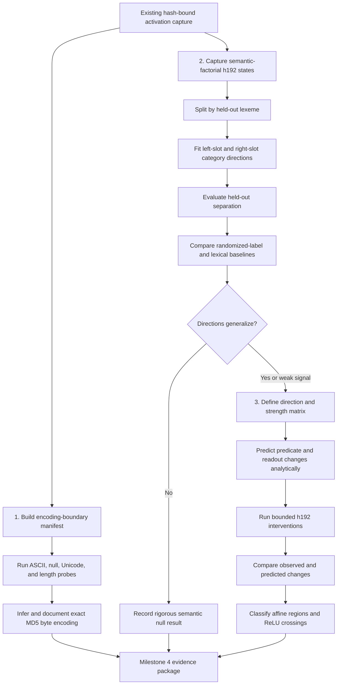

# Jane Street Puzzle Plan

## Source material

- Puzzle Space: https://huggingface.co/spaces/jane-street/puzzle
- Model repo: https://huggingface.co/jane-street/2025-03-10/tree/main

## Problem specification

The puzzle Space loads a PyTorch model from the Hugging Face repo `jane-street/2025-03-10` and exposes a text input box. The app sends the raw input string directly into the model and returns a numeric output.

The prompt text in the Space says:

- "Today I went on a hike and found a pile of tensors..."
- "I'm not sure what it does yet..."
- "Maybe start by looking at the last two layers."

From the current `app.py` in the Space:

- The repo ID is `jane-street/2025-03-10`
- The loaded file is `model_3_11.pt` for Python 3.11, otherwise `model.pt` for the older runtime
- Inference is `model(text)`
- The example input is `vegetable dog`

This means the practical objective for this project is to reverse engineer or characterize what the version-appropriate model artifact computes from text input, likely by inspecting architecture, weights, and behavior on carefully chosen prompts.

## Immediate project goals

1. Download the version-appropriate model artifact locally without executing it implicitly in unknown code paths.
2. Inspect the file safely and record metadata such as size, hash, and loading requirements.
3. Build a controlled analysis script that can load the model in an isolated environment.
4. Investigate the model architecture, especially the last two layers as hinted by the puzzle.
5. Probe the input/output behavior to infer the text transformation or scoring rule.

## Suggested workflow

1. Verify the downloaded artifact and compute checksums.
2. Create a small inspection script to load the model on CPU.
3. Print the model class, module tree, and final layers.
4. Test simple two-word inputs and look for patterns in outputs.
5. Document hypotheses and eliminate them systematically.

## Safety notes

- The Hugging Face repo marks the model files as pickle-based artifacts.
- Treat the file as untrusted serialized code/data.
- Do not load it outside a controlled Python environment.
- Keep any exploratory loader scripts minimal and auditable.

## Deliverables for this setup step

- `planning.md`
- local copy of `model_3_11.pt` for Python 3.11, or `model.pt` for the older runtime
- basic provenance notes for where the file came from

## Milestone 4 Execution Plan and Results

All three workstreams below are now implemented. The evidence supports a bounded MD5 conclusion,
a semantic null result, and exact causal agreement in the final circuit; it does not establish a
universal Unicode-to-MD5-byte conversion rule.

### Task graph

Workstreams 1 and 2 can run in parallel. Workstream 3 depends on the candidate directions or the
documented null result from Workstream 2. A null result does not block completion: it changes the
causal test from validating a semantic direction to demonstrating that fitted correlations do not
produce stable downstream effects.

### 1. Establish the exact MD5 input encoding

The current MD5 conclusion covers only short ASCII strings. Add activation cases for:

- lengths 54, 55, and 56 to confirm truncation behavior;
- embedded and trailing null characters;
- Latin-1 characters, wider Unicode characters, and emoji;
- inputs whose Unicode code points exceed byte range; and
- equivalent-looking but differently normalized Unicode strings.

For every case, compare the decoded predicate bytes with explicitly named candidate byte
encodings, including full UTF-8, 55-character-truncated UTF-8, Latin-1 where defined, and the
model's null-padded code-point representation where it can be converted to bytes. Record false as
well as successful candidate matches.

Acceptance criterion: document exactly how the model converts its 55-code-point input
representation into the byte sequence hashed by its MD5 circuit, including truncation, embedded
nulls, Unicode behavior, and unsupported or ambiguous cases.

### 2. Extract and validate semantic directions

Capture `h192` for the existing semantic-factorial suite, then:

- define category contrast vectors using training lexemes only;
- hold out entire lexemes, not random pairs, to prevent lexical leakage;
- measure category separation on held-out inputs;
- compare against randomized-label and lexical-identity baselines;
- test left-word and right-word directions separately; and
- report uncertainty and negative findings.

The analysis must predeclare the lexeme split, direction normalization, score, permutation or
randomization procedure, and success threshold. Repeated pairs containing the same lexeme must not
be treated as independent evidence.

Because `h192` appears to encode MD5, the expected result is that semantic directions will not
generalize. A rigorous null result satisfies this part of the milestone when the controls show
that any training separation is explained by lexical identity or chance.

### 3. Relate directions to downstream output

First add a bounded, hash-bound additive intervention at `h192`; this is the enabling mechanism
needed to test direction strengths rather than only observe correlations. For every candidate
direction and intervention strength:

- predict changes to all 16 predicate values analytically;
- measure actual changes in predicate values and equality indicators;
- measure the affine readout preactivation;
- measure the final ReLU output; and
- distinguish motion within one affine region from crossing predicate or final-ReLU boundaries.

Use predicate values, individual equality indicators, and readout preactivation as the primary
response variables. The published scalar will usually remain zero because it requires all 16
target matches simultaneously.

Acceptance criterion: each intervention is bound to the model, source activation report,
direction vector, held-out cases, and strength grid; predicted and observed downstream changes are
reported together; and any mismatch is explained by a crossed ReLU boundary, numeric tolerance,
or a falsified local model.

### Deliverables and completion gates

| Workstream | Required artifacts | Completion gate |
|---|---|---|
| MD5 encoding | Versioned boundary manifest, validated activation report, encoding analysis | Complete: 55-character cutoff confirmed; universal UTF-8/Latin-1/padded rule falsified and ambiguity documented |
| Semantic directions | Factorial activation report, fixed lexeme split, direction-analysis output | Complete: left 0.180 and right 0.207 held-out accuracy versus 0.200 chance; rigorous null |
| Downstream effects | Versioned intervention specification and validated causal report | Complete: 1,800 semantic interventions and canonical controls; max readout error `3.05e-05` |
| Milestone synthesis | Updated observations and representation-analysis documents | Complete: evidence, falsifications, and limitations are recorded |
